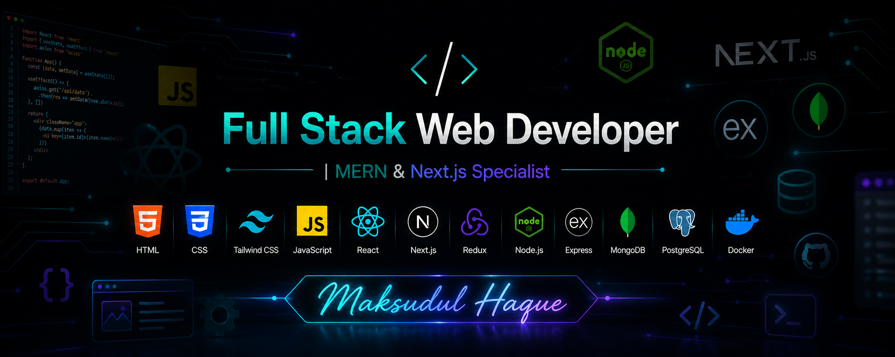

  

<h1 align="center">Maksudul Haque</h1>
<h3 align="center">Full Stack Web Developer | MERN & Next.js Specialist</h3>

  I build fast, scalable, and user-focused web applications from idea to deployment.

  
  
  

---

## About Me

- Full Stack Developer with strong focus on clean architecture and performance.
- Experienced in building production-ready apps using MERN, Next.js, and TypeScript.
- Comfortable across frontend, backend, database design, and deployment pipelines.
- Currently working on EduManage and improving advanced backend system design skills.

---

## What I Can Deliver

- Responsive and modern UI with strong UX principles.
- Secure and scalable REST APIs.
- End-to-end project setup: development, testing, and deployment.
- Maintainable codebases with reusable components and clear structure.

---

## Tech Stack

### Languages & Frameworks

  

### Tools & Platforms

  

---

## Featured Focus

- Building scalable full stack products with Next.js and Node.js.
- Improving backend architecture, caching, and deployment workflows.
- Contributing to practical, real-world web solutions.

---

## GitHub Analytics

  
  

  

  

---

## Connect With Me

  
  
  
  
  
  

  <strong>Email:</strong> smmaksudulhaque2000@gmail.com | <strong>Phone:</strong> +8801518474975

